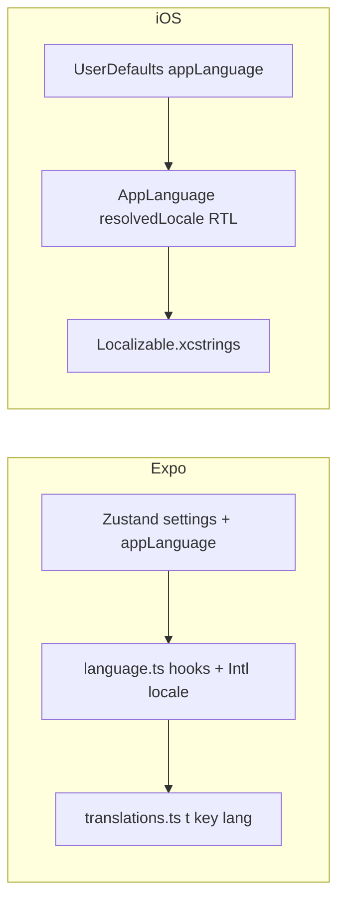

# Multi-language UI (Arabic, Urdu, Indonesian) — Expo + iOS

## Current state (important)

- **Expo** ([`apps/expo/lib/i18n/translations.ts`](apps/expo/lib/i18n/translations.ts)): `en`, `ar`, and `ur` dictionaries are already complete for the shared `TranslationKey` set; **`id` is missing**. The lookup helper `t()` is typed for `"en" | "ar" | "ur"` only.
- **Expo language resolution is stubbed**: [`apps/expo/lib/i18n/language.ts`](apps/expo/lib/i18n/language.ts) always returns English and `isResolvedRightToLeft()` is always `false`, so **no UI ever uses `ar`/`ur` today** despite translations existing. Persisted `appLanguage` was intentionally stripped from the Zustand store in migration ([`apps/expo/store/settings.ts`](apps/expo/store/settings.ts) `stripAppLanguage`).
- **Hardcoded trilingual UI** still bypasses `translations.ts`: [`apps/expo/components/onboarding/TutorialOverlay.tsx`](apps/expo/components/onboarding/TutorialOverlay.tsx), [`apps/expo/components/onboarding/NotificationSetupCard.tsx`](apps/expo/components/onboarding/NotificationSetupCard.tsx).
- **English-only surfaces**: notification category button titles in [`apps/expo/app/_layout.tsx`](apps/expo/app/_layout.tsx), alerts/test copy in [`apps/expo/app/settings.tsx`](apps/expo/app/settings.tsx), and legal screens [`apps/expo/app/masjidly/privacy.tsx`](apps/expo/app/masjidly/privacy.tsx) / [`apps/expo/app/masjidly/terms.tsx`](apps/expo/app/masjidly/terms.tsx).
- **iOS** ([`Masjidly - Official Masjid Prayer Times/Domain/AppLanguage.swift`](Masjidly - Official Masjid Prayer Times/Domain/AppLanguage.swift)): enum is **English-only**; [`SettingsStore`](Masjidly - Official Masjid Prayer Times/Data/Persistence/SettingsStore.swift) **deletes any legacy non-English** `appLanguage` from UserDefaults on init and `resolvedLocale` is hardcoded to `en`. [`HomeView.swift`](Masjidly - Official Masjid Prayer Times/Features/Home/HomeView.swift) also forces `Locale(identifier: "en")` in places, which blocks catalog localization.

## Target behavior (mirrors doubledown’s idea, adapted to your stack)

- User picks **English, العربية, اردو, or Bahasa Indonesia** in **Settings** on both platforms.
- Choice **persists** and applies **immediately** to visible UI, `accessibilityLabel`s, onboarding coach marks, notification bodies (already wired through [`apps/expo/lib/notifications/prayerNotifications.ts`](apps/expo/lib/notifications/prayerNotifications.ts)), and **notification action button titles** once categories are re-registered when language changes.
- **RTL**: Arabic and Urdu use RTL layout direction and appropriate `writingDirection` / row semantics where you already branch (Expo: follow existing [`prayerTimesEngine`](apps/expo/lib/prayer/prayerTimesEngine.ts) locale rules; iOS: `LayoutDirection` / environment where applicable).
- **Indonesian**: LTR; use `id` or `id-ID` for `Intl` / `DateFormatter` as appropriate.

## Part A — Expo (`apps/expo`)

### A1. Persisted `appLanguage` + reactive reads

- Extend [`apps/expo/store/settings.ts`](apps/expo/store/settings.ts): add `appLanguage: AppLanguage` (new exported union type `"en" | "ar" | "ur" | "id"`), `setAppLanguage`, default `en`, bump persist **version** with a `migrate` step that sets `appLanguage: "en"` when missing (do **not** strip the field anymore).
- Replace non-reactive [`resolvedLanguageCode()`](apps/expo/lib/i18n/language.ts) usage in React screens with a **`useAppLanguage()`** hook (Zustand selector) so changing language re-renders. Keep a **`getAppLanguage()`** (or `resolvedLanguageCodeFromStore()`) for non-React modules (`prayerNotifications`, widget bridge) that reads `useSettingsStore.getState()` at scheduling time.
- Implement [`language.ts`](apps/expo/lib/i18n/language.ts): map code → BCP-47 for `resolvedLocale()` (`ar`, `ur`, `id-ID`), `isResolvedRightToLeft()` for `ar` and `ur`, and update [`apps/expo/__tests__/i18n/language.test.ts`](apps/expo/__tests__/i18n/language.test.ts).

### A2. Indonesian catalog + typing

- Add an `id` block to [`translations.ts`](apps/expo/lib/i18n/translations.ts) with **every** `TranslationKey` (copy structure from `en`; professional Indonesian phrasing).
- Widen `t()` and all `"en" | "ar" | "ur"` unions (e.g. [`apps/expo/app/index.tsx`](apps/expo/app/index.tsx) `translatePrayerName`, [`MosqueSelectionCard`](apps/expo/components/onboarding/MosqueSelectionCard.tsx) props, [`prayerNotifications`](apps/expo/lib/notifications/prayerNotifications.ts) casts).

### A3. Eliminate hardcoded onboarding / notification card strings

- Move [`TutorialOverlay`](apps/expo/components/onboarding/TutorialOverlay.tsx) `s()` maps and shortcut strings into **`TranslationKey` entries** (group under `onboarding.*` / `tutorial.*`) for all four languages.
- Refactor [`NotificationSetupCard`](apps/expo/components/onboarding/NotificationSetupCard.tsx) to use `t(key, locale)` instead of `locale === "ar" ? ...` chains.
- Pass language from parents via `useAppLanguage()` (update [`apps/expo/store/onboarding.ts`](apps/expo/store/onboarding.ts) default locale if it still injects `"en"` only).

### A4. Settings UI + system dialogs

- Add an **App language** section to [`apps/expo/app/settings.tsx`](apps/expo/app/settings.tsx) (segmented control, list, or modal like doubledown) calling `setAppLanguage`.
- Add translation keys for **email subjects**, **Alert titles/messages**, and **test notification** strings currently hardcoded in `settings.tsx`.
- Re-register notification categories in [`apps/expo/app/_layout.tsx`](apps/expo/app/_layout.tsx) inside `useEffect` dependent on **`appLanguage`**, with translated `buttonTitle` strings from `translations.ts` (new keys under `notification.action.*`).

### A5. Legal screens

- At minimum: translate **header**, **back** `accessibilityLabel`, and any **section headings** in [`privacy.tsx`](apps/expo/app/masjidly/privacy.tsx) / [`terms.tsx`](apps/expo/app/masjidly/terms.tsx) via `t()`.
- **Policy body**: either (recommended for quality) keep **English body** with a one-line disclaimer in other languages, or add full translated paragraphs (large duplicate content). Call this out in implementation so expectations are explicit.

### A6. Tests and widget

- Update [`apps/expo/__tests__/store/settings.test.ts`](apps/expo/__tests__/store/settings.test.ts) for `appLanguage` default and setter.
- Adjust notification tests if they assert English-only titles/bodies when locale is wired.
- Ensure [`apps/expo/lib/widgets/prayerWidget.ts`](apps/expo/lib/widgets/prayerWidget.ts) / [`useHomePrayerData`](apps/expo/lib/hooks/useHomePrayerData.ts) pass the persisted language into the native widget snapshot.

## Part B — iOS native (`Masjidly - Official Masjid Prayer Times/`)

### B1. `AppLanguage` and `SettingsStore`

- Expand [`AppLanguage.swift`](Masjidly - Official Masjid Prayer Times/Domain/AppLanguage.swift) with cases **`english`**, **`arabic`**, **`urdu`**, **`indonesian`** (raw values stable for persistence, e.g. `english`, `arabic`, `urdu`, `indonesian`).
- Implement `resolvedLanguageCode`, `isResolvedRightToLeft`, and `resolvedLocale()` per language (Urdu/Arabic RTL; Indonesian LTR; use appropriate `Locale(identifier:)` such as `id_ID` for formatting).
- **Remove** the init-time logic in [`SettingsStore.swift`](Masjidly - Official Masjid Prayer Times/Data/Persistence/SettingsStore.swift) that **overwrites** non-English stored values; instead **decode** `AppLanguage(rawValue:)` with fallback to `.english`, and optionally map very old raw strings if any existed historically.
- Change `resolvedLocale` to delegate to `appLanguage.resolvedLocale()` (delete the hardcoded `en`).

### B2. Root locale + SwiftUI

- Apply `.environment(\.locale, settings.resolvedLocale)` (and `.environment(\.layoutDirection, ...)` if needed for RTL) at the **app root** (e.g. [`MasjidlyRootView`](Masjidly - Official Masjid Prayer Times/App/MasjidlyRootView.swift) or equivalent) so `String(localized:)` picks the right variant from the catalog.
- Remove or narrow the **forced** `.environment(\.locale, Locale(identifier: "en"))` overrides in [`HomeView.swift`](Masjidly - Official Masjid Prayer Times/Features/Home/HomeView.swift) so localized strings and formatters respect the user’s language.

### B3. `Localizable.xcstrings`

- In Xcode String Catalog, add **Arabic, Urdu, and Indonesian** localizations for **all** keys already used via `String(localized:)` / `homeLS` patterns across Features (Settings, Onboarding, Home, Notifications content, etc.). Use the Expo `translations.ts` English text as a **source-of-meaning checklist** to avoid missing keys (the catalogs are separate files but should stay semantically aligned).

### B4. Settings UI (iOS)

- Add language picker to [`SettingsView.swift`](Masjidly - Official Masjid Prayer Times/Features/Settings/SettingsView.swift) / [`SettingsViewModel.swift`](Masjidly - Official Masjid Prayer Times/Features/Settings/SettingsViewModel.swift) bound to `settings.appLanguage`, with localized labels for each option.

### B5. Widgets / notifications parity

- [`WidgetPrayerSnapshotService`](Masjidly - Official Masjid Prayer Times/Features/Widgets/WidgetPrayerSnapshotService.swift) and notification content builders should use **`settings.appLanguage`** (or resolved locale) so widget text and `UNNotification` strings match the in-app language where applicable (same spirit as Expo).

### B6. Swift tests

- Update [`Masjidly - Official Masjid Prayer TimesTests/MasjidlyTests.swift`](Masjidly - Official Masjid Prayer TimesTests/MasjidlyTests.swift) (and any language-related tests) for decoding/persistence and `resolvedLocale` behavior.

## Verification (user runs `/build` or Xcode)

- Expo: run your existing Jest suite after edits (per your workflow).
- iOS: build with Xcode; smoke-test language switch on Home, Settings, Onboarding, Timetable, notifications, and widget snapshot path.

## Risk / scope note

- **Two string repositories** (Expo TS table + iOS xcstrings) will diverge unless you maintain a **key checklist** when adding UI; optional later improvement is a small codegen or export script — not required for the first delivery if you accept manual parity discipline.
